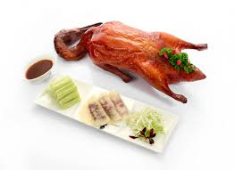

# Peking duck
---
## Whole Duck and pancakes

---
## Duck Facts
-  Peking Duck was originated in china in 1330.
- In China there are no single best restuarants to for peking Duck.
- There are recommended restaurants in Beijing; Siji Minfu, Dadong, and Jingzun.
- 

---
## Restaurants that have Peking Duck

| restaurant    | location    | phone        |
|---------------|-------------|--------------|
| jiangnan      | Fort Lee    | 2014292888   |
| Jiang Nan NJC | Jersey City | 201 333 6668 |

